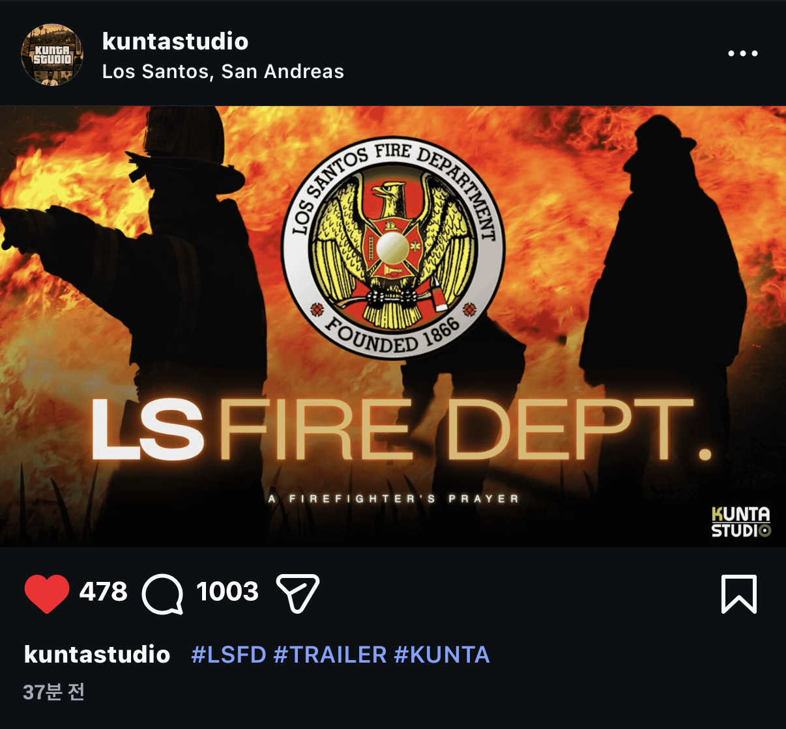

---
hide:
  - toc
  - navigation
---

<section class="ks-hero" aria-label="KUNTA STUDIO">
  
  

</section>

<section class="ks-intro">
  

    

      Division
      Multimedia
      Los Santos
    

    

      Field
      NEWS · MEDIA
      Report & Archive
    

    

      Service
      AD · PR
      Promotion
    

  

  <blockquote class="ks-intro__quote">"가장 낮은 곳의 목소리부터 가장 화려한 축제의 현장까지"</blockquote>
  
KUNTA STUDIO는 현장 취재와 영상 제작, 홍보 광고까지 아우르는 종합 미디어 팩션입니다.

  
우리는 도시의 구석구석을 연결하며, 로스 산토스와 함께 성장하고 있습니다.

</section>

<section class="ks-section">
  <header class="ks-section-head">
    

      01 / Contents
      <h2 class="ks-section-head__title">Our <em>Contents</em></h2>
    

  </header>

  

  <a class="ks-service-card" href="https://forum-kr.gta.world/index.php?/forum/79-%EB%89%B4%EC%8A%A4-%EC%B1%84%EB%84%90/" target="_blank" rel="noopener noreferrer">
    01
    

      
    

    

      Field Report
      <h3 class="ks-service-card__name">NEWS</h3>
      
LS 인사이더 및 현장 취재. 거리의 이슈를 가감 없이 전달합니다.

      Open News Channel →
    

  </a>

<a class="ks-service-card" href="contents/">
  02
  

    
  

  

    Video Production
    <h3 class="ks-service-card__name">YouTube</h3>
    
영상 편집 및 아카이빙. 도시의 순간을 기록하고 공유합니다.

    View Contents →
  

</a>

  <article class="ks-service-card ks-service-card--static">
    03
    

      
    

    

      Promotion
      <h3 class="ks-service-card__name">ADVERTISING</h3>
      
기업 및 개인 홍보 광고. 브랜드의 메시지를 도시에 전달합니다.

    

  </article>

  

</section>

